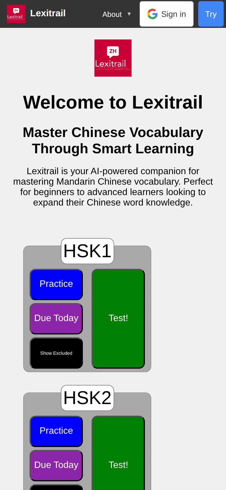
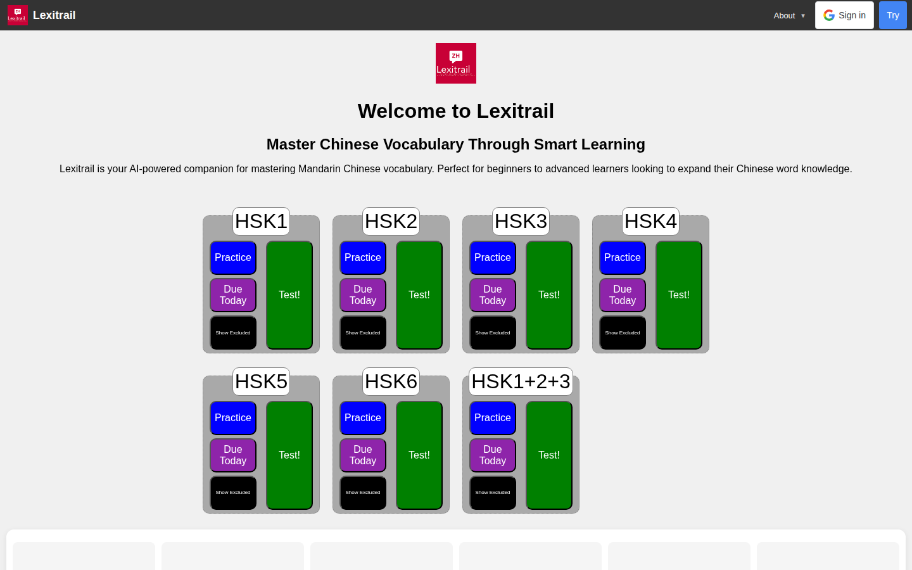

# lexitrail#52 — tap-target floor, shipped 2026-08-09

Screenshot-after-ship artifacts for the 44px tap-target fix (PR #83, deployed
via `tools/cd/poll_deploy.py`). Both captured from **live prod** after the
rollout served, with analytics aborted before navigation (2 blocked, 0
completed — the funnel stayed clean).

## The measurement, before and after

Taken by `e2e/tap_targets.py` against `https://lexitrail.com/`, same command
both times — the fix is the only variable.

| viewport | before | after |
|---|---|---|
| mobile 390×844 | **23 of 33** controls under 44px | **0** |
| desktop 1440×900 | **16 of 33** controls under 44px | **0** |

```
VERDICT: PASS (exit 0)
```

The five controls that were failing: `.try-button` (43.7×32),
`.google-signin-compact` (92.8×32), `.wordset-button-practice` (×7, 34px tall),
`.wordset-button-due` (×7, 34px), `.wordset-button-excluded` (×7, 25px).

## Why this was invisible to the existing test

`ui/src/styles/tapTargets.test.js` checks that the CSS *declares* a ≥44px floor,
and it was green throughout. Three of the five controls were simply **not in its
enumerated selector list**, so it was never looking at them. The other two were
declared correctly and constrained by their parent. Neither gap is visible from
a declaration; both are obvious from a rendered box.

## Screenshots

### Mobile — 390×844



### Desktop — 1440×900



## What is NOT covered

Only the public landing page. The guest and authenticated journeys in
`docs/itp-playwright-usability.md` are unmeasured and may carry the same defect
— extending the harness to them is the natural next step, and it must keep the
analytics abort installed on the context before the first navigation and must
never click "Sign in with Google".
